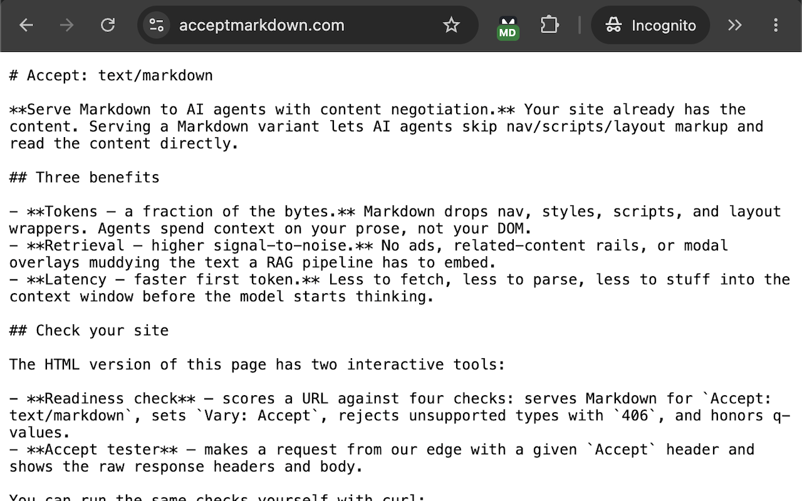

# Accept: text/markdown Toggle

A minimal Chrome extension: one toolbar button that toggles the current tab's `Accept`
request header between the browser default and `text/markdown`, reloading the page.



## Install

1. Open `chrome://extensions` and turn on **Developer mode**.
2. **Load unpacked**, and select this folder.
3. Click the toolbar puzzle-piece icon and **pin** "Accept: text/markdown Toggle" so it sits
   to the right of the address bar.

## Use

Click the icon. The tab reloads requesting `Accept: text/markdown` and the button shows a
green **MD** badge. Click again and it reloads with Chrome's normal `Accept` header.

The toggle is per tab: turning it on in one tab does not affect any other tab. State is
held in `declarativeNetRequest` session rules, so it clears when Chrome quits.

## Reading the result

The extension changes the request, so what comes back tells you what the site supports.
All three outcomes are useful:

- **A Markdown page** (`Content-Type: text/markdown`): the site supports Markdown content
  negotiation and served it.
- **The normal HTML page**: the site ignored the `Accept` header. It has no content
  negotiation for Markdown.
- **406 Not Acceptable**: the site negotiates content properly but has no Markdown
  representation of that URL. This is a valid result and not a failure of the extension.

The header sent is deliberately just `text/markdown`, with no `text/html` or `*/*`
fallback. A fallback would make the second and third cases indistinguishable, since the
server could satisfy it with HTML either way. Keeping the request strict is what makes the
outcome above unambiguous, which matters because this is a diagnostic tool rather than
something to browse with.

## How it works

`background.js` keys a session rule to the tab id:

```js
condition: { tabIds: [tabId], resourceTypes: ["main_frame"] }
action:    { type: "modifyHeaders",
             requestHeaders: [{ header: "Accept", operation: "set", value: "text/markdown" }] }
```

Session rules are the only rule type that accepts a `tabIds` condition. The live rule set
is the only place state is kept, so the service worker can be terminated and restarted
without the badge and the header drifting apart. Reloads pass `bypassCache: true`, since a
cached navigation would never send the new header.

## Notes

- Only the top-level document request is changed. Subresources and `fetch`/XHR are untouched.
- Whether anything differs is up to the server. Sites that ignore `Accept` return the same
  HTML; the badge reflects the header being sent, not the response.
- Chrome has no viewer for `text/markdown`. Depending on the response `Content-Type`, a
  Markdown response renders as plain text or downloads as a file. That is Chrome, not a bug here.
- `chrome://` pages, other extensions' pages, and the Web Store cannot be modified; clicks
  there are ignored.
